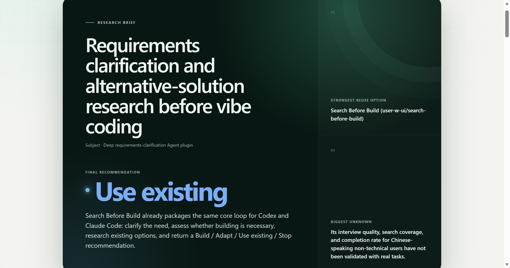
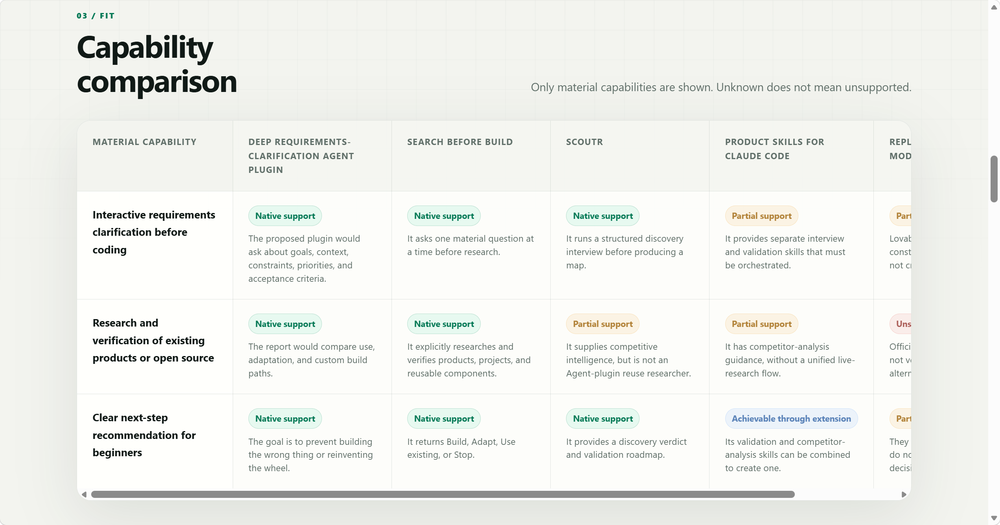
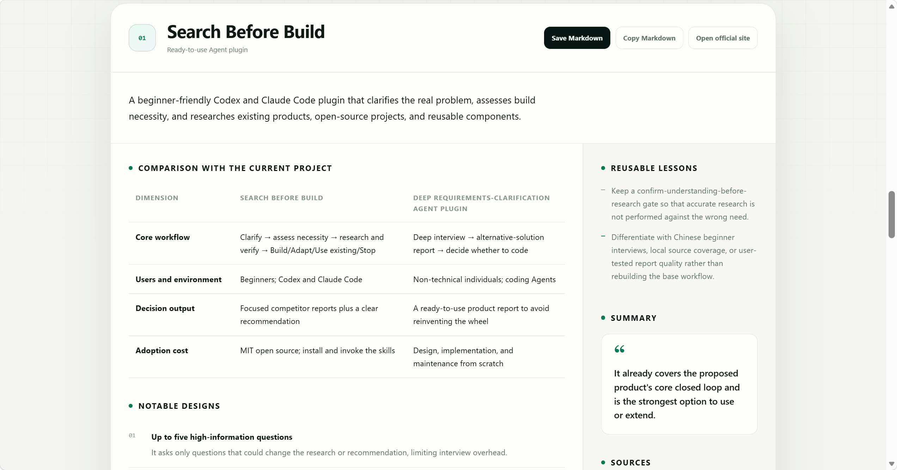

<div align="center">


# Search Before Build

**Before you start vibe coding, make sure the idea is actually worth building.**

A lightweight, beginner-friendly plugin for Codex and Claude Code. It helps you clarify the problem, decide whether development is necessary, and seriously look for existing products, open-source projects, and reusable components.

[](https://www.npmjs.com/package/@superq/search-before-build)


[](./LICENSE)

[English](./README.md) | [简体中文](./README.zh-CN.md)

</div>

---

## Why does this exist?

Vibe coding has made the distance between “I have an idea” and “I’m writing code” incredibly short. That feels great, but it also makes it easy to build an entire system for a one-off problem, discover a mature product halfway through, reinvent the wheel, or spend a huge number of tokens on a project you will never use.

`search-before-build` is not here to discourage ideas. It simply asks you to pause for a few minutes before starting and answer three questions:

1. **What are you actually trying to solve?**
2. **Does this really need to be built?**
3. **Is there an existing solution you can use or adapt?**

## How does it work?

```text
A vague idea
     │
     ▼
Clarify the real problem ──→ Decide whether it is worth building ──→ Find and verify existing solutions
                                                                                  │
                                                                                  ▼
                                                             Build / Adapt / Use existing / Stop
```

It ends with a clear recommendation that you remain free to override:

| Recommendation | Meaning |
| --- | --- |
| **Build** | The need is real, and existing solutions do not cover the critical gap |
| **Adapt** | A close solution already exists, and modifying it makes more sense than starting from scratch |
| **Use existing** | A mature solution already addresses the main problem, so using it is the better trade-off |
| **Stop** | Evidence for the need is weak, or the cost of building clearly outweighs the benefit |

## Two skills

| Skill | Best for | What it does |
| --- | --- | --- |
| `search-before-build-assess` | You have an idea but have not started | Reads the available context first, asks only for missing critical information (one question at a time, up to five), then researches and recommends a direction |
| `search-before-build-compare` | You already have a plan, prototype, or repository | Extracts capabilities from the existing material, then looks directly for comparable products and reusable solutions |

```text
/search-before-build:search-before-build-assess I want to build a tool that automatically organizes saved content
/search-before-build:search-before-build-compare ./docs/plan.md
```

## More than GitHub search

The plugin first determines what it needs to find, then chooses where to look. It extracts a functional fingerprint from your needs and searches only relevant sources instead of scanning every platform every time.

| What you are looking for | Preferred source |
| --- | --- |
| Open-source repositories, source code, or reusable implementations | GitHub |
| JavaScript / Node.js dependencies, CLIs, or plugins | npm |
| Cross-ecosystem package metadata and maintenance signals | Ecosyste.ms Packages |
| MCP tools or connectors for agents | Official MCP Registry |
| JVM dependencies (Java / Kotlin / Android) | Maven Central |
| Rust crates | crates.io |
| Models, datasets, or reusable AI applications | Hugging Face Hub |
| Algorithms, papers, or academic precedents | arXiv |

For SaaS products, commercial tools, app-store listings, and other solutions outside those catalogs, it supplements the research with web search and official product pages. When the target market is unclear, it searches in both Chinese and English. Stars and download counts help assess maturity, but never replace functional matching, and similar names alone are not treated as evidence that two products compete.

### Optional in-depth GitHub search

If a GitHub MCP server, connector, or equivalent tool is available, the plugin reuses it. Otherwise, it can still work through public APIs and web search. With your consent, it can install GitHub’s official MCP server automatically:

```text
Enable in-depth GitHub search
```

The installer downloads and verifies the official binary, then runs it with the `repos` toolset in `--read-only` mode. The first connection uses browser-based OAuth, so no PAT, Docker, or extra package is required. It supports Windows, macOS, and Linux and requires Node.js 18 or later; the basic research workflow itself does not depend on Node.js. If installation is declined or authorization fails, it falls back automatically.

## Temporary research brief and optional saving

After research, the plugin renders a polished local HTML brief containing the final recommendation, search coverage, capability matrix, strongest candidates, reusable lessons, and unknowns. The page is a self-contained offline file with no CDN dependency. It overwrites one file in the OS temporary directory, so a casual question does not leave reports in the current project.

### Read a research brief in three steps

[Explore a live report](https://user-w-ui.github.io/search-before-build/)

**1. Start with the decision**

Turn the real need, strongest evidence, and remaining unknowns into one clear recommendation before development begins.

[](./assets/showcase/en/01-decision.png)

**2. Inspect the capability matrix**

Compare only decision-relevant capabilities with consistent support labels. Missing evidence stays unverified instead of becoming unsupported.

[](./assets/showcase/en/02-capability-matrix.png)

**3. Examine each candidate**

Review adoption cost, material constraints, reusable designs, and traceable primary sources for every strong candidate.

[](./assets/showcase/en/03-competitor-analysis.png)

Every competitor has **Save Markdown** and **Copy Markdown** actions. A long-lived report is created only when you choose to export it after reviewing the result, or explicitly ask the plugin to persist a selected competitor:

```text
docs/search-before-build/<current-project>/<competitor>.md
```

Persisted reports remain one file per competitor and contain only the overview, comparison with the current project, notable designs, reusable lessons, one-sentence summary, and sources. They exclude the necessity check and final verdict.

## Installation and usage

**Codex (one command)**

```bash
npx @superq/search-before-build install
```

Then open a new Codex task:

```text
$search-before-build-assess <your idea, plan, or file path>
$search-before-build-compare <path to a plan, prototype, or repository>
```

**Codex (development install, tracks `main`)**

```bash
codex plugin marketplace add user-w-ui/search-before-build --ref main
codex plugin add search-before-build@search-before-build
```

**Claude Code (marketplace)**

```text
/plugin marketplace add user-w-ui/search-before-build
/plugin install search-before-build@search-before-build
```

After installation, use `/search-before-build:search-before-build-assess` or `...-compare`. Update it with `/plugin marketplace update search-before-build`.

**Claude Code (local loading)**

```bash
claude --plugin-dir /path/to/search-before-build
```

**Validate the plugin**

```bash
claude plugin validate --strict .
python tests/validate_plugin.py
```

## Contributing

Issues and pull requests are welcome, especially for commonly overlooked search platforms, false matches between similarly named but functionally different products, reuse cases that save meaningful time or tokens, and wording that is still too difficult for non-technical users.

---

<div align="center">

### Think twice. Build once.

</div>
